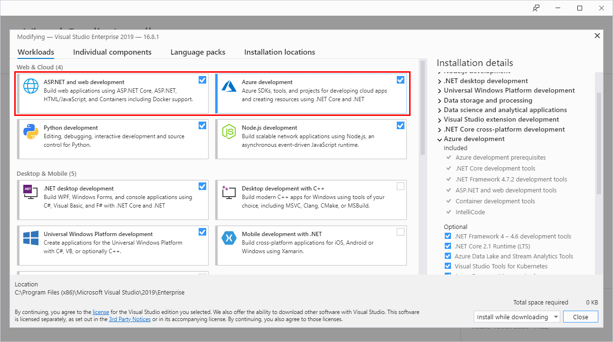
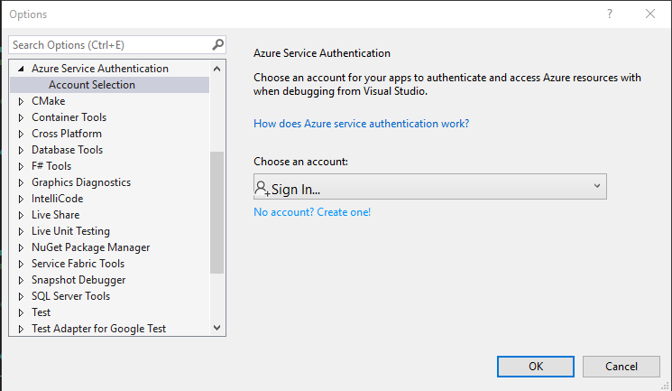

# Consulta- fundamentos de C#
**Interantes:** Mateo Barriga.
**Fecha:** 20 de noviembre del 2023.

## Objetivos: 
Dentro de este informe lo que se requiere hacer es aprender un poco mas de lo que se trata el lenguaje de programación de C#, para asi poder tener un manejo óptimo de el para futuras clases que se realicen con el ingeniero. 

## Tema 1: Introducción de C#

### ¿Que es c#?

C# (pronunciado "si sharp" en inglés) es un lenguaje de programación moderno, basado en objetos y con seguridad de tipos. C# permite a los desarrolladores crear muchos tipos de aplicaciones seguras y sólidas que se ejecutan en .NET. C# tiene sus raíces en la familia de lenguajes C, y a los programadores de C, C++, Java y JavaScript les resultará familiar inmediatamente.

C# es un lenguaje de programación orientado a componentes, orientado a objetos. C# proporciona construcciones de lenguaje para admitir directamente estos conceptos, por lo que se trata de un lenguaje natural en el que crear y usar componentes de software.

### Historia y evolución de C#

En el transcurso del desarrollo de la plataforma .NET, se redactaron inicialmente las bibliotecas de clases mediante un sistema de código gestionado denominado Simple Managed C (SMC). En abril de 1999, Anders Hejlsberg encabezó un equipo con la tarea de crear un nuevo lenguaje orientado a objetos. Debido a problemas de marca, fue necesario cambiar su nombre a C#.2​ En ese momento, la biblioteca de clases de la plataforma .NET fue trasladada al nuevo lenguaje y posteriormente fue modificado por Joseth M.

Anders Hejlsberg lideró el proyecto de creación de C#. Anteriormente, ya había contribuido al desarrollo de otros lenguajes como Turbo Pascal, Delphi y J++.

### Plataformas compatibles

C# (C Sharp) es un lenguaje de programación desarrollado por Microsoft y, por lo tanto, está estrechamente asociado con las plataformas y tecnologías de Microsoft.

- .NET Framework: Es la plataforma principal para el desarrollo de aplicaciones en Windows. Se utiliza comúnmente para desarrollar aplicaciones de escritorio y servicios web.

- .NET Core: Es la versión multiplataforma y de código abierto de .NET. Puedes usar C# para desarrollar aplicaciones que se ejecuten en sistemas operativos Windows, Linux y macOS.

- Xamarin: Permite el desarrollo de aplicaciones móviles para iOS y Android utilizando C#. Puedes compartir gran parte del código entre las versiones de iOS y Android de tu aplicación.

- Unity: Es un motor de juego muy popular que utiliza C# como uno de sus principales lenguajes de scripting. Se utiliza para desarrollar juegos y experiencias interactivas en diversas plataformas, incluyendo PC, consolas y dispositivos móviles.

- ASP.NET: Utilizado para el desarrollo de aplicaciones web, ASP.NET permite a los desarrolladores crear sitios web dinámicos y aplicaciones web utilizando C#.

- Azure: La plataforma en la nube de Microsoft, Azure, admite el desarrollo de servicios en la nube y aplicaciones escalables utilizando C#.

- Windows Presentation Foundation (WPF): Es un marco de desarrollo de interfaz gráfica de usuario para aplicaciones de escritorio en Windows que utiliza C#.

- Windows Communication Foundation (WCF): Se utiliza para construir servicios y aplicaciones distribuidas en el entorno Windows, y puedes usar C# para desarrollar aplicaciones que utilicen WCF.

## Tema 2: Configuración del entorno de desarrollo 
### Instalación de Visual Studio
1. Descargar:
- Ve al sitio web oficial de Visual Studio Code: Descargar VSCode.
- Haz clic en el enlace de descarga para Windows.

2. Instalación:
- Una vez que se complete la descarga, ejecuta el archivo de instalación (https://visualstudio.microsoft.com/es/downloads/).
- Sigue las instrucciones del instalador, haciendo clic en "Siguiente" o "Next" según sea necesario.
- Asegúrate de marcar la opción "Añadir al PATH" durante la instalación.
3. Finalización:

- Después de la instalación, puedes iniciar Visual Studio Code desde el menú de inicio o mediante el acceso directo en el escritorio.

### Configuración de entorno de desarrollo. 
1. Abra el Instalador de Visual Studio y asegúrese de que tiene instaladas las cargas de trabajo de desarrollo de Azure y desarrollo web y de ASP.NET. Si alguna de estas cargas de trabajo no está instalada, selecciónelas para instalarlas.


2. Autenticación de Visual Studio con Azure
Al depurar aplicaciones a través de Visual Studio, Visual Studio puede usar su cuenta de Azure para autenticarse y acceder a los recursos de Azure. Esta cuenta también se usa cuando se publican aplicaciones directamente desde Visual Studio en Azure.

Para autenticar su cuenta de Azure desde Visual Studio, seleccione el menú Herramientas>Opciones para iniciar el cuadro de diálogo Opciones. Vaya a las opciones de autenticación del servicio de Azure e inicie sesión con su cuenta de Azure.

## Tema3: Sintaxis básica de C#
### Estructura de un programa en C#

Un programa en C# sigue una estructura básica que incluye elementos clave. 
1. Espacios de nombres(Namespaces): 
- Los programas en C# a menudo comienzan con la declaración de espacios de nombres, que son contenedores para organizar y agrupar clases y otros elementos. Por ejemplo:
```c#
using System;
```
2. Clases principales(main class):
- C# es un lenguaje orientado a objetos, y la ejecución de un programa comienza en la clase que contiene el método Main. Este método es el punto de entrada del programa. Por ejemplo:
```c#
class Program
{
    static void Main()
    {
        // Código principal aquí
    }
}
```
3. Directivas using(using directives):
- Las directivas using se utilizan para importar espacios de nombres adicionales que contienen clases y funciones que se usarán en el programa. Por ejemplo:
```c#
using System;
using System.Collections.Generic;
```
4. Declaracion de variables y constantes: 
- Puedes declarar variables y constantes para almacenar y manejar datos en el programa. Por ejemplo:

```c#
int edad = 25;
const double Pi = 3.14;
```
5. Métodos(Methods):
- Los métodos son bloques de código que realizan tareas específicas. El método Main es un ejemplo, pero puedes crear tus propios métodos. Por ejemplo:

```c#
static void Saludar()
{
    Console.WriteLine("¡Hola!");
}
```
6. Sentencia de control de flujo: 
- Las sentencias como if, else, for, while, y switch permiten controlar el flujo de ejecución del programa. Por ejemplo:
```c#
if (edad >= 18)
{
    Console.WriteLine("Eres mayor de edad.");
}
else
{
    Console.WriteLine("Eres menor de edad.");
}

```
7. Entradas/Salidas (input/output)
- Las operaciones de entrada y salida son cruciales. Puedes usar Console.WriteLine para imprimir en la consola y Console.ReadLine para leer la entrada del usuario.
8. Comentarios: 
Los comentarios son anotaciones que no afectan la ejecución del programa. Se utilizan para hacer el código más comprensible. Por ejemplo:
```c#
// Este es un comentario de una sola línea

/*
   Este es un comentario
   de múltiples líneas
*/
```
### Variables y tipos de datos: 
#### Tipos de Datos enteros: 
| Tipo |Equivalente BCL | Tamaño | Intervalo | Significado|
| -------- | -------- | -------- | --- | --- |
|byte|System.Byte|8-bit(1-byte)|0 a 255|entero sin signo|
|sbyte|System.SByte|8-bit(1-byte)|-128 a 127|entero sin signo|
|short|System.Int16|16-bit(2-byte)|-32.768 a 32.767|entero corto con signo|
|ushort|System.UInt16|16-bit(2-byte)|0 a 65.535|entero corto con signo|
|int|System.Int32|32-bit(4-byte)|-2.147.483.648 a 2.147.483.647|entero medio con signo|
|uint|System.UInt32|32-bit(4-byte)|0 a 4.294.967.295|entero medio con signo|
|long|System.Int64|64-bit(8-byte)|-9.223.372.036.854.775.808 a 9.223.372.036.854.775.807|entero largo con signo|
|ulong|System.UInt64|64-bit(8-byte)|0 a 18.446.744.073.709.551.615|entero largo con signo|
|nint|System.IntPtr|64-bit o 32-bit(4-byte o 8-byte)|Depende de la plataforma en la que se ejecute|entero nativo con signo|
|nuint|System.UIntPtr|64-bit o 32-bit(4-byte o 8-byte)|Depende de la plataforma en la que se ejecute|entero nativo con signo|
#### Tipos de Datos flotantes: 
| Tipo |Equivalente BCL | Tamaño | Intervalo | Significado|
| -------- | -------- | -------- | --- | --- |
|float|System.Single|32-bit(4-byte)|±1.401298E−45 a ±3.402823E+38|Coma flotante corto|
|double|System.Double|64-bit(8-byte)|±4.94065645841246E−324 a ±1.79769313486232E+308|Coma flotante largo|
|decimal|System.Decimal|128-bit(16-byte)|−7.9228162514264337593543950335 a +7.9228162514264337593543950335|Coma flotante momentario|
#### Tipos de Datos caracteres: 
| Tipo |Equivalente BCL | Tamaño | Intervalo | Significado|
| -------- | -------- | -------- | --- | --- |
|char|System.Char|16-bit(2-byte)|'\u0000' a '\uFFFF'|Carácter unicode|

#### Tipos de Datos lógico: 
| Tipo |Equivalente BCL | Tamaño | Intervalo | Significado|
| -------- | -------- | -------- | --- | --- |
|bool|System.Boolean|8-bit(1-byte)|true o false|Verdadero o falso|

#### Variables
Las variables son identificadores asociados a valores. Se declaran indicando el tipo de dato que almacenará y su identificador.

Un identificador puede:

- empezar por "_".
- contener caracteres Unicode en mayúsculas y minúsculas (sensible a mayúsculas y minúsculas).

Un identificador no puede:

- empezar por un número.
- empezar por un símbolo, ni aunque sea una palabra clave.
- contener más de 511 caracteres.

Declarar una variable:

```c#
int miNumero; // Declaramos la variable, pero no la inicializamos con ningún valor.
```
Para asignar un valor a una variable, se indica el identificador de la misma, seguido del símbolo igual (=) y el valor que queremos que almacene:
```c#
miNumero = 5; // Asignamos el valor '5' a la variable creada.
```
Se puede declarar y asignar un valor al mismo tiempo:
```c#
int miNumero = 5; // Declaramos la variable, y asignamos el valor '5'.
```
También puedes declarar una variable sin especificar el tipo de dato, utilizando el mecanismo de inferencia mediante la palabra clave var donde el compilador determina el tipo de dato que se le asignará a la variable y solamente es permitida para variables locales, no para parámetros o datos miembro.
```c#
var cadena = "Esto es un string";
var numero1 = 5;
var numero2 = 4.5;
var numero3 = 4.5D;
var objeto = new Object();
var resultado = Math.Pow(5, 2);
```
### Operadores Básicos

| Categoría | Operadores |
| -------- | -------- |
|Aritméticos|+ - * / %|
|Lógicos|! && II|
|A nivel de bits|& | ^ ~|
|Concatenación|+|
|Incremento, Decremento|++ --|
|Desplazamiento|<< >>|
|Relacional|== != < > <= >=|
|Asignación|= ^= <<= >>= ??=|
|Acceso a miembro|.|
|Indexación|[]|
|Conversión|()|
|Codicional|? : ??|
|Creación de objetos|new|
|Información de tipo|as is sizeof typeof|

- Los operadores aritméticos funcionan igual que en C y C++.
- El resultado de los operadores relacionales y lógicos es un valor de tipo bool.
- Los operadores de cortocircuito evalúan el segundo operando solo cuando es necesario.
- Los operadores a nivel de bits no se pueden aplicar a tipos bool, float, double o decimal.

## Tema 4: Control de Flujos y Estructuras de control
### Condicionales(if, else, switch)

Las instrucciones if, if-else y switch seleccionan las instrucciones que se ejecutarán a partir de muchos trazados posibles en función del valor de una expresión. La instrucción if ejecuta una instrucción solo si una expresión booleana proporcionada se evalúa como true. La instrucción if-else permite elegir cuál de las dos rutas de acceso al código se deben seguir en función de una expresión booleana. La instrucción switch selecciona una lista de instrucciones para ejecutarla en función de la coincidencia de un patrón con una expresión.

#### Intrucción if
Una instrucción if puede tener cualquiera de las dos formas siguientes:

- Una instrucción if con una parte else selecciona una de las dos instrucciones que se ejecutarán en función del valor de una expresión booleana, como se muestra en el ejemplo siguiente:
```c#
DisplayWeatherReport(15.0);  // Output: Cold.
DisplayWeatherReport(24.0);  // Output: Perfect!

void DisplayWeatherReport(double tempInCelsius)
{
    if (tempInCelsius < 20.0)
    {
        Console.WriteLine("Cold.");
    }
    else
    {
        Console.WriteLine("Perfect!");
    }
}
```
- Una instrucción if sin una parte else ejecuta el cuerpo solo si una expresión booleana se evalúa como true, como se muestra en el ejemplo siguiente:
```c#
DisplayMeasurement(45);  // Output: The measurement value is 45
DisplayMeasurement(-3);  // Output: Warning: not acceptable value! The measurement value is -3

void DisplayMeasurement(double value)
{
    if (value < 0 || value > 100)
    {
        Console.Write("Warning: not acceptable value! ");
    }

    Console.WriteLine($"The measurement value is {value}");
}
```
Puede anidar instrucciones if para comprobar varias condiciones, como se muestra en el ejemplo siguiente:
```c#
DisplayCharacter('f');  // Output: A lowercase letter: f
DisplayCharacter('R');  // Output: An uppercase letter: R
DisplayCharacter('8');  // Output: A digit: 8
DisplayCharacter(',');  // Output: Not alphanumeric character: ,

void DisplayCharacter(char ch)
{
    if (char.IsUpper(ch))
    {
        Console.WriteLine($"An uppercase letter: {ch}");
    }
    else if (char.IsLower(ch))
    {
        Console.WriteLine($"A lowercase letter: {ch}");
    }
    else if (char.IsDigit(ch))
    {
        Console.WriteLine($"A digit: {ch}");
    }
    else
    {
        Console.WriteLine($"Not alphanumeric character: {ch}");
    }
}
```
#### Instrucción switch
La instrucción switch selecciona una lista de instrucciones para ejecutarla en función de la coincidencia de un patrón con una expresión de coincidencia, como se muestra en el ejemplo siguiente:
```c#
DisplayMeasurement(-4);  // Output: Measured value is -4; too low.
DisplayMeasurement(5);  // Output: Measured value is 5.
DisplayMeasurement(30);  // Output: Measured value is 30; too high.
DisplayMeasurement(double.NaN);  // Output: Failed measurement.

void DisplayMeasurement(double measurement)
{
    switch (measurement)
    {
        case < 0.0:
            Console.WriteLine($"Measured value is {measurement}; too low.");
            break;

        case > 15.0:
            Console.WriteLine($"Measured value is {measurement}; too high.");
            break;

        case double.NaN:
            Console.WriteLine("Failed measurement.");
            break;

        default:
            Console.WriteLine($"Measured value is {measurement}.");
            break;
    }
}
```
En el ejemplo anterior, una instrucción switch usa los siguientes patrones:

- Un patrón relacional para comparar el resultado de una expresión con una constante.
- Una patrón de constante: para probar si el resultado de una expresión es igual a una constante.
### Bucle (for, while, do-while)
#### Do - while 
La instrucción do ejecuta una instrucción o un bloque de instrucciones mientras que una expresión booleana especificada se evalúa como true. Como esa expresión se evalúa después de cada ejecución del bucle, un bucle do se ejecuta una o varias veces. El bucle do difiere del bucle while, que se ejecuta cero o varias veces.
```c#
int n = 0;
do
{
    Console.Write(n);
    n++;
} while (n < 5);
// Output:
// 01234
```
La instrucción while ejecuta una instrucción o un bloque de instrucciones mientras que una expresión booleana especificada se evalúa como true. Como esa expresión se evalúa antes de cada ejecución del bucle, un bucle while se ejecuta cero o varias veces. El bucle while difiere del bucle do, que se ejecuta una o varias veces.
```c#
int n = 0;
while (n < 5)
{
    Console.Write(n);
    n++;
}
// Output:
// 01234
```
#### For
La instrucción for ejecuta una instrucción o un bloque de instrucciones mientras una expresión booleana especificada se evalúa como true. En el ejemplo siguiente se muestra la instrucción for, que ejecuta su cuerpo mientras que un contador entero sea menor que tres:
```c#
for (int i = 0; i < 3; i++)
{
    Console.Write(i);
}
// Output:
// 012
```
## Tema 5: Funciones y métodos en C#
### Declaracion y llamada de funciones. 
#### Declaracion de funciones. 
La declaración de funciones en C# sigue un formato específico y está compuesta por varios elementos esenciales.
1. Encabezado de la función: 
- Comienza con el tipo de retorno, que indica el tipo de dato que la función devolverá. Puede ser void si la función no devuelve ningún valor.
```c#
int Sumar(int a, int b)
{
    // Cuerpo de la función
}
```
2. Nombre de la función: 
- Después del tipo de retorno, se especifica el nombre de la función.
```c#
void MostrarMensaje()
{
    // Cuerpo de la función
}
```
3. Parámetros 
- Entre paréntesis se definen los parámetros que la función espera. Los parámetros son valores que se pasan a la función cuando es llamada. 
```c#
void Saludar(string nombre)
{
    // Cuerpo de la función
}
```
4. Cuerpo de función: 
- Es el bloque de código que se ejecuta cuando la función es llamada. Contiene las instrucciones y lógica específica de la función.
```c#
int Sumar(int a, int b)
{
    int resultado = a + b;
    return resultado;
}
```
5. Palabra Clave 'return':
- Si la función devuelve un valor, se utiliza la palabra clave return seguida del valor que se va a devolver. Si el tipo de retorno es void, no es necesario utilizar return.
```c#
void MostrarMensaje()
{
    Console.WriteLine("¡Hola!");
}
```
6. Alcance de las variables: 
- Las variables declaradas dentro de la función tienen un alcance limitado a esa función, a menos que se declaren como variables de nivel de clase.
7. Métodos Estáticos:
- Si una función pertenece a una clase y no a una instancia específica de la clase, se declara como estática.
```c#
static void MetodoEstatico()
{
    // Cuerpo del método estático
}
```
8. Modificadores de Acceso: 
- Puedes usar modificadores de acceso como public, private, protected, etc., para controlar la visibilidad de la función desde otras partes del código.

#### LLamado de funciones: 

El llamado de funciones en C# sigue un formato específico que implica proporcionar los argumentos necesarios y, en algunos casos, gestionar el valor devuelto por la función. 
1. Llamado simple: 
- Se llama a una función proporcionando su nombre seguido de paréntesis. Si la función no espera argumentos, los paréntesis están vacíos.
 ```c#
MostrarMensaje(); // Llamado a la función sin argumentos

```
2. Paso de Argumentos: 
- Si la función espera argumentos, se proporcionan entre paréntesis durante el llamado.
 ```c#
Saludar("Juan"); // Llamado a la función con un argumento
```
3. Gestion de valor devuelto:
- Si la función devuelve un valor, este puede ser asignado a una variable o utilizado directamente.
 ```c#
int resultado = Sumar(3, 4); // Llamado a la función con argumentos y gestión del valor devuelto

```
4. Llamado de métodos estático: 
- Si la función es estática y pertenece a una clase, se utiliza el nombre de la clase seguido de un punto y luego el nombre del método.
 ```c#
ClaseEjemplo.MetodoEstatico(); // Llamado a un método estático

```
5. Parámetros por Valor y por Referencia:
- Los parámetros por valor pasan una copia del valor original, mientras que los parámetros por referencia pasan la dirección de memoria.
 ```c#
void ModificarValor(int x) { /* ... */ }
void ModificarReferencia(ref int y) { /* ... */ }

int a = 5;
ModificarValor(a); // a se mantiene igual
ModificarReferencia(ref a); // a podría cambiar

```
6. Parámetros Opcionales: 
- Puedes definir parámetros con valores predeterminados, lo que los convierte en opcionales durante el llamado.
 ```c#
void EjemploOpcional(int x, int y = 10) { /* ... */ }
EjemploOpcional(5); // y toma el valor predeterminado

```
7. Uso de as palabras clave 'out':
- Se utiliza para indicar que un argumento se pasa como referencia y se espera que la función lo inicialice.
 ```c#
void ObtenerResultado(out int resultado) { resultado = 42; }
int valor;
ObtenerResultado(out valor); // valor ahora es 42

```
8. Llamado de funciones de clases: 
- Se pueden llamar funciones de clases instanciadas, utilizando una instancia de la clase.
 ```c#
MiClase miObjeto = new MiClase();
miObjeto.Metodo(); // Llamado a un método de instancia

```
### Parametros y argumentos
En C#, los términos "parámetros" y "argumentos" se utilizan para describir la entrada y salida de una función.
1. Parámetros: 
- Los parámetros son variables que se definen en la firma de una función y actúan como marcadores de posición para los valores que se pasarán cuando se llame a la función.
- Los parámetros se definen en la declaración de la función y especifican el tipo de dato y el nombre que se utilizará dentro de la función.
- Ejemplo de definición de función con parámetros:
 ```c#
void Sumar(int a, int b)
{
    int resultado = a + b;
    Console.WriteLine("La suma es: " + resultado);
}

```
2. Argumentos: 
- Los argumentos son los valores reales que se pasan a una función cuando se llama. Estos valores deben coincidir en tipo y posición con los parámetros de la función.
- Los argumentos se proporcionan entre paréntesis durante el llamado a la función.
- Ejemplo de llamado a la función con argumentos:
 ```c#
Sumar(5, 3); // 5 y 3 son argumentos que se pasan a los parámetros a y b de la función Sumar

```
3. Tipos de parametros: 
- Parámetros por Valor: Pasan una copia del valor original. Los cambios dentro de la función no afectan a la variable original.
 ```c#
void Duplicar(int x)
{
    x *= 2;
}
int numero = 10;
Duplicar(numero); // La variable "numero" no cambia

```
- Parámetros por Referencia (ref): Pasan la dirección de memoria. Los cambios dentro de la función afectan a la variable original.
 ```c#
void Triplicar(ref int x)
{
    x *= 3;
}
int numero = 10;
Triplicar(ref numero); // La variable "numero" ahora es 30

```
- Parámetros Opcionales: Tienen valores predeterminados y no es necesario proporcionar un valor durante el llamado.

 ```c#
void Saludo(string nombre, string saludo = "Hola")
{
    Console.WriteLine(saludo + ", " + nombre);
}
Saludo("Juan"); // Salida: Hola, Juan
Saludo("Maria", "¡Hola"); // Salida: ¡Hola, Maria

```
- Parámetros de Salida (out): Indican que la función asignará un valor a la variable proporcionada.
 ```c#
void ObtenerResultado(out int resultado)
{
    resultado = 42;
}
int valor;
ObtenerResultado(out valor); // "valor" ahora es 42

```
### Retorno de valores
El retorno de valores en C# se refiere a la capacidad de una función (método) para devolver un resultado después de su ejecución.
 1. Declaracion de tipos de retorno: 
 - Al definir una función, se especifica el tipo de dato que la función devolverá. Puede ser un tipo primitivo, un objeto, o incluso un tipo complejo.
```c#
int Sumar(int a, int b)
{
    return a + b; // La función devuelve un entero
}

```
2. Palabra clave 'return': 
- La palabra clave return se utiliza para devolver un valor desde la función.
- Una vez que se encuentra la instrucción return, la ejecución de la función se detiene y el valor se devuelve al lugar desde donde se llamó a la función.
```c#
int ObtenerNumero()
{
    return 42; // Devuelve el valor 42
}


```
3. Uso de 'void' cuando no hay retorno: 
- Si una función no devuelve ningún valor, se utiliza void en lugar de un tipo de datos.
```c#
void Saludar(string nombre)
{
    Console.WriteLine("Hola, " + nombre);
}
```
4. Multiples vias de retorno: 
- Una función puede tener múltiples declaraciones return en diferentes puntos del código. La ejecución saldrá de la función tan pronto como encuentre una de estas declaraciones.
```c#
int CalcularCuadrado(int x)
{
    if (x < 0)
        return 0; // Retorna 0 si x es negativo
    
    return x * x; // Retorna el cuadrado de x para valores no negativos
}
```
5. Uso de 'out' para retornar multiples valores: 
- Además del retorno único, se puede utilizar la palabra clave out para que una función devuelva varios valores.
```c#
void ObtenerDatos(out int a, out int b)
{
    a = 10;
    b = 20;
}

```
## Estructuras de datos básicas
### Arreglos
1. Declaración de Arreglos:

- Los arreglos en C# se declaran utilizando la sintaxis:
```c#
tipo[] nombreArreglo;
```
2. Inicialización de Arreglos:
- Se pueden inicializar arreglos al momento de la declaración o posteriormente.
```c#
int[] numeros = { 1, 2, 3, 4, 5 };
```
3. Acceso a Elementos:

- Los elementos de un arreglo se acceden mediante su índice, que comienza en cero.
```c#
int primerNumero = numeros[0];
```
4. Longitud del Arreglo:

- La propiedad Length se utiliza para obtener la longitud (número de elementos) de un arreglo.
``` c#
int longitud = numeros.Length;
```
5. Modificación de Elementos:

- Se pueden modificar los elementos de un arreglo asignando nuevos valores a través de sus índices.
``` c#
numeros[0] = 10;
```
6. Arreglos Multidimensionales:

- C# admite arreglos multidimensionales, como matrices.
``` c#
int[,] matriz = new int[3, 3];
```
7. Arreglos Jagged:

- Son arreglos de arreglos, donde cada elemento puede ser un arreglo independiente.
``` c#
int[][] jaggedArray = new int[3][];
jaggedArray[0] = new int[] { 1, 2, 3 };
jaggedArray[1] = new int[] { 4, 5 };
jaggedArray[2] = new int[] { 6, 7, 8, 9 };
```
8. Métodos de Arreglos:

- C# proporciona métodos útiles en la clase Array, como Sort para ordenar elementos.
``` c#
int[] numeros = { 5, 2, 8, 1, 3 };
Array.Sort(numeros);
```
9. Copiar Arreglos:

- Puedes copiar arreglos utilizando el método CopyTo o creando un nuevo arreglo y utilizando Array.Copy.
``` c#
int[] copia = new int[numeros.Length];
numeros.CopyTo(copia, 0);
```
10. Foreach con Arreglos:

- Se puede utilizar un bucle foreach para iterar a través de los elementos de un arreglo.
``` c#
foreach (int num in numeros)
{
    // Hacer algo con num
}
```
### Listas
1. Declaración de Listas:

- Las listas en C# se declaran utilizando la clase List<T>, donde T es el tipo de elementos que contendrá la lista.
``` c#
List<int> numeros = new List<int>();
```
2. Inicialización de Listas:

- Puedes inicializar listas al momento de la declaración o después.
``` c#
List<string> colores = new List<string> { "Rojo", "Verde", "Azul" };
```
3. Añadir Elementos:

- Se utilizan métodos como Add para añadir elementos a la lista.
``` c#
numeros.Add(10);
numeros.Add(20);
```
4. Acceso a Elementos:

- Los elementos se acceden mediante sus índices, que comienzan en cero.
``` c#
int primerNumero = numeros[0];
```
5. Longitud de la Lista:

- La propiedad Count se utiliza para obtener la cantidad de elementos en la lista.
``` c#
int cantidad = numeros.Count;
```
6. Eliminar Elementos:

- Se pueden eliminar elementos por valor o índice usando métodos como Remove o RemoveAt.
``` c#
numeros.Remove(10);
numeros.RemoveAt(0);
```
7. Verificación de Existencia:

- Puedes verificar si un elemento está en la lista utilizando métodos como Contains.
``` c#
bool contiene = numeros.Contains(10);
```
8. Ordenar y Revertir:

- Los métodos Sort y Reverse permiten ordenar y revertir los elementos de la lista.
``` c#
numeros.Sort();
numeros.Reverse();
```
9. Búsqueda y Filtrado:

- Utiliza métodos como Find o FindAll para buscar o filtrar elementos según ciertos criterios.
``` c#
int encontrado = numeros.Find(x => x == 10);
List<int> filtrados = numeros.FindAll(x => x > 5);
```
10. Iteración con Foreach:

- Puedes utilizar un bucle foreach para iterar a través de los elementos de la lista.
``` c#
foreach (int num in numeros)
{
    // Hacer algo con num
}
```
11. Conversión con Arrays:

- Puedes convertir una lista a un array y viceversa.
``` c#
int[] arrayNumeros = numeros.ToArray();
List<int> listaDesdeArray = new List<int>(arrayNumeros);
```
12. Clear y TrimExcess:

- Clear elimina todos los elementos de la lista, mientras que TrimExcess reduce la capacidad al número actual de elementos.
``` c#
numeros.Clear();
numeros.TrimExcess();
```
### Diccionarios

1. Declaración de Diccionarios:

- Los diccionarios en C# se declaran usando la clase Dictionary<TKey, TValue>, donde TKey es el tipo de la clave y TValue es el tipo del valor.
``` c#
Dictionary<string, int> edades = new Dictionary<string, int>();
```
2. Agregar Elementos:

- Puedes añadir elementos al diccionario usando la sintaxis de índice.
``` c#
edades["Juan"] = 25;
edades["María"] = 30;
```
3. Acceso a Elementos:

- Se accede a los elementos mediante sus claves.
``` c#
int edadJuan = edades["Juan"];
```
4. Verificación de Existencia:

- Puedes verificar si una clave existe antes de acceder a ella.
``` c#
if (edades.ContainsKey("Juan"))
{
    // hacer algo
}
```

5. Iteración a través de Elementos:

- Utiliza un bucle foreach para iterar a través de pares clave-valor.
``` c#
foreach (var par in edades)
{
    string nombre = par.Key;
    int edad = par.Value;
    // hacer algo con nombre y edad
}
```
6. Eliminación de Elementos:

- Usa el método Remove para eliminar un elemento por clave.
``` c#
edades.Remove("Juan");
```
7. Longitud del Diccionario:

- La propiedad Count te da el número de elementos en el diccionario.
``` c#
int cantidad = edades.Count;
```
8. Obtener Todas las Claves o Valores:

- Puedes obtener todas las claves o todos los valores como listas.
``` c#
List<string> nombres = edades.Keys.ToList();
List<int> edadesList = edades.Values.ToList();
```
9. Clear:

- Clear elimina todos los elementos del diccionario.
``` c#
edades.Clear();
```
10. Comprobar si está Vacío:

- Utiliza Any para comprobar si hay algún elemento en el diccionario.
``` c#
if (edades.Any())
{
    // hacer algo
}
```
11. Valores Predeterminados:

- Puedes especificar un valor predeterminado al intentar acceder a una clave que no existe.
``` c#
int edadPedro = edades.GetValueOrDefault("Pedro", 0); // Devolverá 0 si "Pedro" no está en el diccionario.
```
12. Diccionario Inmutable (C# 9 en adelante):

- A partir de C# 9, puedes usar ImmutableDictionary para crear diccionarios inmutables.
```c#
var diccionarioInmutable = ImmutableDictionary<string, int>.Empty.Add("Juan", 25);
```
## Tema 7: Programación orienada a objetos (POO)
### Clases y objetos:
1. Clases:

- Una clase en C# es un plano para crear objetos. Define propiedades, métodos y eventos que forman la estructura y el comportamiento del objeto.
``` c#
public class Persona
{
    // Propiedades
    public string Nombre { get; set; }
    public int Edad { get; set; }

    // Método
    public void Saludar()
    {
        Console.WriteLine($"Hola, soy {Nombre}.");
    }
}
```
2. Objetos:

- Un objeto es una instancia de una clase. Se crea utilizando el operador new.
``` c#
Persona persona1 = new Persona();
```

### Herencias polimorfismos
1. Herencia:

- Permite que una clase herede propiedades y métodos de otra. Facilita la reutilización del código.
``` c#
public class Estudiante : Persona
{
    public string Curso { get; set; }
}
```
2. Polimorfismo:

- Múltiples clases pueden proporcionar una implementación diferente para el mismo método. Se puede lograr a través de la sobrecarga y la anulación de métodos.
``` c#
public override void Saludar()
{
    Console.WriteLine($"Hola, soy {Nombre}, y soy estudiante de {Curso}.");
}
```
### Encapsulamiento y abstracción
1. Encapsulamiento:

- Oculta los detalles internos de una clase y expone solo lo necesario. Se logra mediante el uso de modificadores de acceso (public, private, etc.).
``` c#
private int edad;  // Solo accesible dentro de la clase
```
2. Abstracción:

- Representa solo las características esenciales de un objeto, ocultando detalles irrelevantes. Se logra mediante el uso de clases abstractas e interfaces.
``` c#
public abstract class Figura
{
    public abstract void Dibujar();
}
```